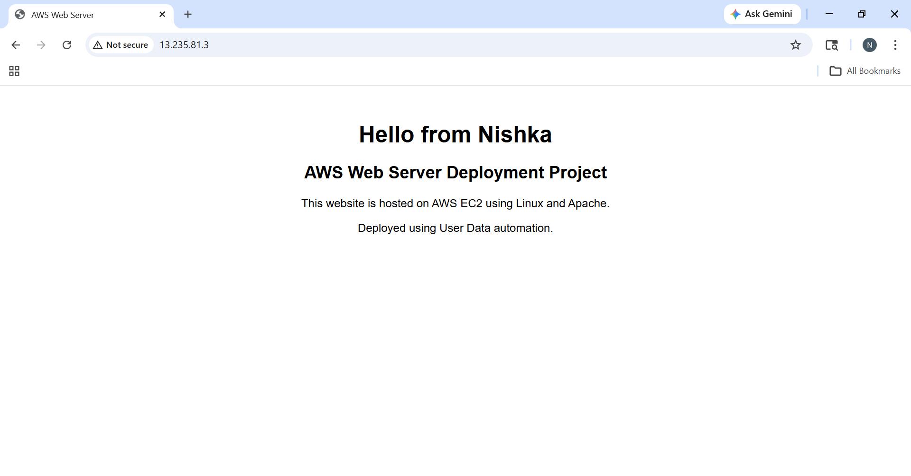
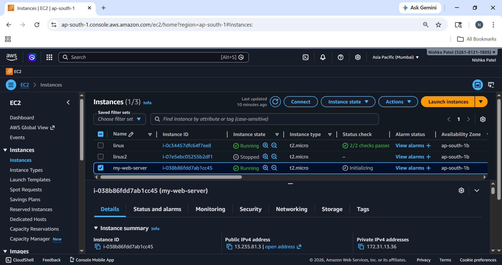
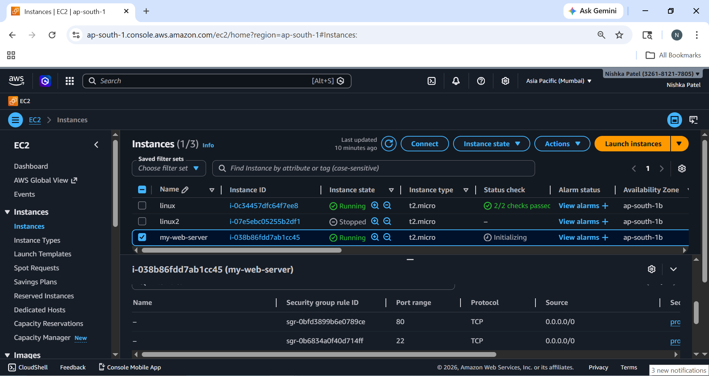
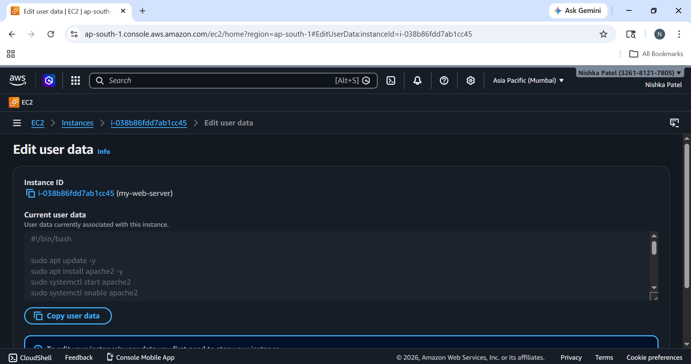

# AWS Web Server Deployment Project

## Project Overview
This project demonstrates the deployment of a web server on AWS EC2 using Linux (Ubuntu) and Apache.

The setup is automated using a User Data script, which installs and configures the Apache web server during instance launch.

---

##  Services & Tools Used
- AWS EC2
- Linux (Ubuntu)
- Apache Web Server
- User Data Script
- Security Groups

---

##  Steps Performed
1. Launched EC2 instance on AWS
2. Configured Security Group (HTTP & SSH access)
3. Used User Data script for automation
4. Installed and configured Apache Web Server
5. Hosted a static website
6. Accessed the website using Public IP

---

##  Project Files

- `index.html` → Website content  
- `user-data.sh` → Automation script  
- `screenshots/` → Project proof images  

---

##  Output

---

##  Screenshots

### EC2 Instance Running

### Security Group Configuration

### User Data Script

---

##  Key Learnings
- AWS EC2 instance management
- Linux server configuration
- Web server deployment using Apache
- Basic networking (Security Groups)
- Automation using User Data script

---

##  Author
Nishka Patel
